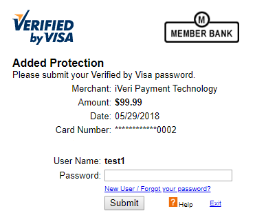

An express checkout transaction allows the integrator to capture the customers payment method and details inside their application and initiate payment without redirecting the user to Paynow. This is ideal for mobile applications; however, integrators should be aware of PCI DSS requirements for capturing Visa/Mastercard details within their applications.

Express checkout transactions currently support mobile money and Visa/Mastercard payment methods.

For mobile money payment method (Ecocash and OneMoney are currently supported) the mobile subscriber specified in the initiate message will have a USSD session pushed to their handset prompting them to enter their mobile wallet PIN number to authorize the transaction (or to cancel the transaction).

For Visa/Mastercard payment method, the user may be required to complete a 3D Secure/SecureCode challenge in the source application. More details on this in the [3D Secure/SecureCode Challenge](#3d-secure-securecode-challenge) are below.

## Initiate an Express Checkout Transaction

To initiate an express checkout transaction, an HTTP POST request should be made to the URL:

https://www.paynow.co.zw/interface/remotetransaction

The fields below are required in addition to those specified in the [Initiate a Transaction](initiate_transaction.md) section

**Required For**|**Field**|**Data Type**|**Description**
-----|-----|-----|-----
All|method|String|ecocash = Ecocash mobile money **OR** onemoney = OneMoney mobile money **OR** vmc = Visa/Mastercard
Mobile Money|phone|String|The subscriber number of the mobile money wallet to be debited
Visa/Mastercard|cardnumber|Numeric|The Visa/Mastercard PAN
Visa/Mastercard|cardname|String|Name printed on front of card
Visa/Mastercard|cardcvv|Numeric|3 or 4 digits from rear of card
Visa/Mastercard|cardexpiry|Numeric|6 digit card expiry date (MMYYYY) e.g. 052018
Visa/Mastercard|billingline1|String|Customer’s billing address
Visa/Mastercard|billingline2|String|Not required but will assist with fraud detection
Visa/Mastercard|billingcity|String|Customer’s billing address city
Visa/Mastercard|billingprovince|String|Not required but will assist with fraud detection
Visa/Mastercard|billingcountry|String|Customer’s billing address country
Visa/Mastercard|token|String|A token returned by a previous **tokenized** transaction. Used to carry out recurring payments without requiring further input from the card holder

>**N.B.** The integration ID must have an Ecocash/OneMoney/Visa/Mastercard payment method selected for use in the Paynow setup area.

>**N.B.** In the case of Visa/Mastercard, the response to the above request should be inspected to check if a 3D Secure challenge is required to be completed by the card holder. This will be indicated by Status=Pending3ds. See [3D Secure/SecureCode Challenge](#3d-secure-securecode-challenge) below.

>**N.B.** For Visa/Mastercard **token** transactions, the **merchanttrace** field is required. These transactions will be automatically re-tokenized during the payment and the updated token will be returned in the **status update** callback message

## 3D Secure/SecureCode Challenge

This is an additional security measure that applies to Visa/Mastercard express checkout transactions, which is put in place by the bank that issued the card to ensure that they are in fact the rightful owner of the card before payment is processed. Although it increases payment friction for the card holder, it provides protection for the merchant from fraudulent purchases by placing the onus on the card holder.

In some cases, the 3D Secure/SecureCode can be skipped by the merchant, although it is not advisable. If you require this, please contact our support department for more information.

If the status field of the response message following an express checkout initiate request is `Pending3ds` it means that the card holder is required to complete the 3D Secure/SecureCode challenge before the payment will be processed. The following additional fields will be present in the response message:

**Field**|**Description**
-----|-----
AcsUrl|The URL that the challenge request should be sent to when initializing the challenge
PaReq|The payload of the challenge request
MD|The identifier linking the challenge being requested to the card being used for payment
CallbackUrl|The URL on Paynow where the result of the challenge should be sent

The integrator should send a FORM POST to the `AcsUrl` address, containing values for:
**Field**|**Description**
-----|-----
PaReq|As per express checkout response from Paynow
MD|As per express checkout response from Paynow
TermUrl|This is the URL **on the integrator’s server** where the result of the challenge will be posted

The result of this form post will be HTML containing the 3D Secure/SecureCode challenge like the image below



> N.B. In some cases, the challenge from the issuing bank will autocomplete itself. However, this is carried out gracefully and should not affect your application flow.

Once the challenge “password” is submitted, the challenge processor will POST the result of the challenge to the URL you specified in the `TermUrl` field. The following values will be included in the POST to the `TermUrl`:

**Field**|**Description**
-----|-----
PaRes|The payload response of the challenge
MD|The identifier linking the challenge being requested to the card being used for payment

These values should then be sent to the CallbackUrl from the “Initiate Express Checkout” response message, so that the card payment can be completed by Paynow (the CallbackUrl is of the format https://www.paynow.co.zw/interface/remote3ds?guid=xxxxxxxx-xxxx-xxxx-xxxx-xxxxxxxxxxxx)

The values that should be included in this POST are:

**Field**|**Data Type**|**Description**
-----|-----|-----
id|Integer|Integration ID shown to the merchant in the “3rd Party Site or Link Profile” area of “Receive Payment Links” section of “Sell or Receive” on Paynow
status|String|Should be set to “Message” at this stage of the transaction
pares|String|As received by your TermUrl from the challenge response
md|String|As received by your TermUrl from the challenge response
hash|String|Details of Hash generation are provided in a later section of this document

Below is an example of a successful remote3ds response:

```http
Status=Ok&PollUrl=http%3a%2f%2fwww.paynow.co.zw%3a7106%2fInterface%2fCheckPayment%2f%3fguid%3d3cb27f4b-b3ef-4d1f-9178-5e5e62a43995& PaynowReference=12345&Hash=8614C21DD93749339906DB35C51B06006B33DC8C192F40DFE2DB6549942C837C4452E1D1333DE9DB7814B278C8B9E3C34D1A76D2F937DEE57502336E0A071412
```

Below is an example of a failed remote3ds response:

```http
Status=Error&Error=ElectronicCommerceIndicator+ThreeDSecure+or+ThreeDSecureAttempted+required
```